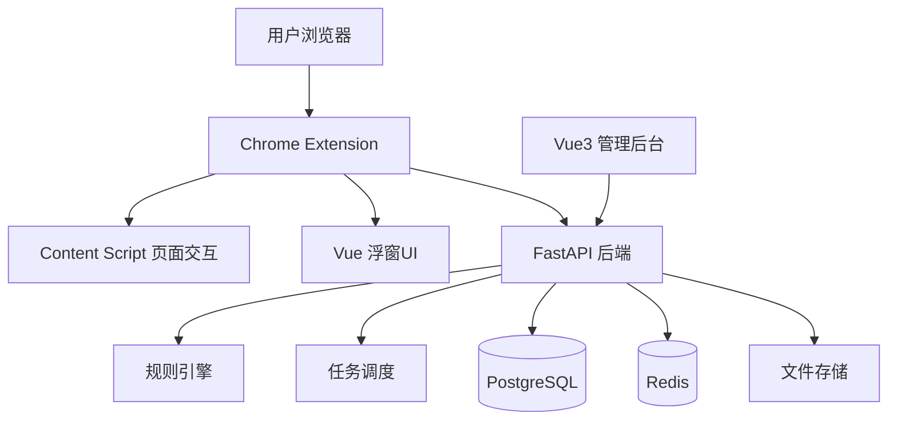
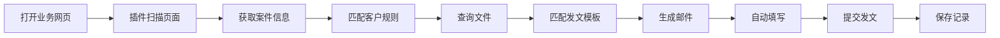
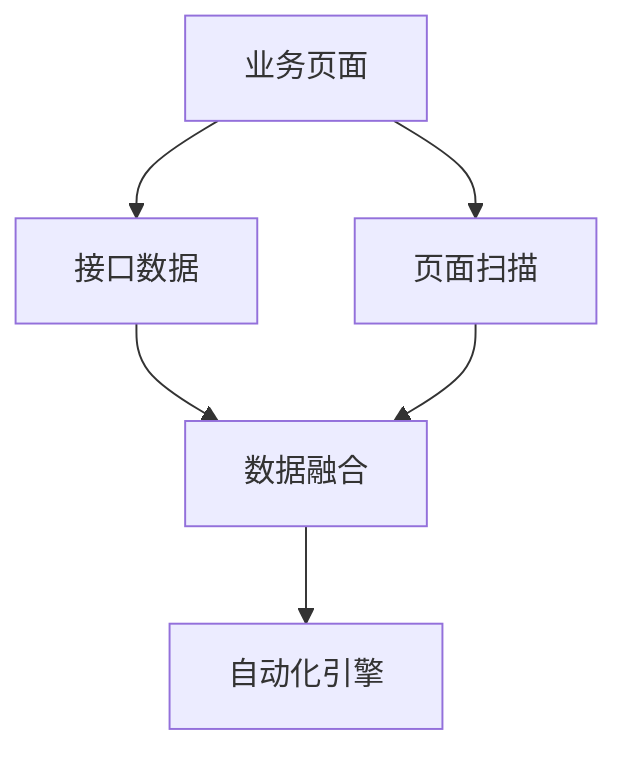
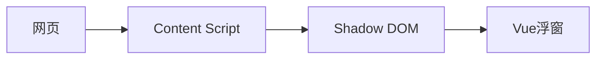
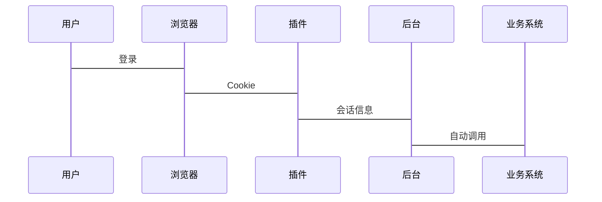
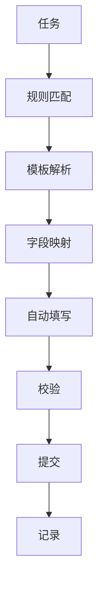
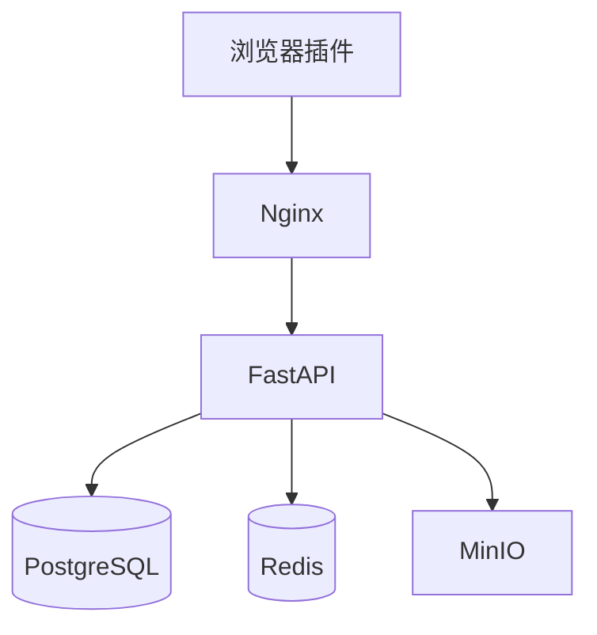

# PatMail 专利发文自动化系统
## 技术栈选型与技术可行性实现方案

版本：v1.0

---

# 1. 项目概述

PatMail 是面向知识产权代理机构、企业 IP 部门的专利发文自动化系统。

核心目标：

> 将人工重复性的网页查询、文件匹配、模板填写、邮件发送流程自动化。

解决：

- 多客户不同发文规则
- 大量专利文件重复查询
- 人工复制字段
- 邮件模板重复编辑
- 收件人/抄送人维护困难
- 发文记录不可追踪

---

# 2. 总体架构



---

# 3. 技术栈选型

## 3.1 浏览器插件

技术：

- TypeScript
- Vue3
- Vite
- Chrome Extension Manifest V3
- Content Script
- Shadow DOM


作用：

- 页面扫描
- DOM解析
- 自动填充
- 自动提交
- Cookie复用
- 浮窗交互


---

## 3.2 管理后台

技术：

- Vue3
- TypeScript
- Vite
- Pinia
- Element Plus
- ECharts


功能：

- 客户管理
- 模板管理
- 发文规则管理
- 文件管理
- 发文记录
- 数据统计


---

## 3.3 后端

技术：

- Python
- FastAPI
- SQLAlchemy
- Pydantic
- Celery
- Redis


原因：

- 自动化生态成熟
- 规则处理方便
- AI能力扩展方便


---

## 3.4 数据库

推荐：

PostgreSQL


存储：

- 客户信息
- 模板配置
- 规则配置
- 任务状态
- 操作日志


---

## 3.5 文件存储

采用：

- MinIO
- 或服务器文件系统


不使用数据库二进制存储。


---

# 4. 核心业务流程



---

# 5. 数据采集方案

采用 API + DOM 双通道。




---

## API优先

优势：

- 稳定
- 快速
- 数据结构明确


---

## DOM补充

解决：

- 页面变化
- 新字段
- 客户特殊流程


支持：

- 获取表单
- 获取下拉选项
- 自动生成字段映射


---

# 6. 模板系统

支持：

- 历史查询模板
- 客户模板
- 用户自定义模板


组合方式：

```
最终模板

=

基础模板

+

客户模板

+

临时覆盖
```


---

# 7. 规则引擎

采用 JSON DSL。


示例：

```json
{
 "customer":"华为",
 "send_type":"merge",
 "receiver":[
    "test@example.com"
 ],
 "title_rule":"{申请号}-{文件类型}"
}
```


支持：

- 条件判断
- 字段映射
- 默认值
- 动态变量


---

# 8. 浮窗技术方案


采用：

Chrome Extension Floating Panel


结构：




优势：

- 不污染网页
- 样式隔离
- 可拖动
- 可关闭


---

# 9. Cookie登录方案


支持：

## 用户登录

用户手动登录网页。


## 浏览器复用

读取：

- Cookie
- Session
- Token


流程：



---

# 10. 自动执行引擎


流程：



---

# 11. 安全设计

## Cookie

- 本地加密
- 不明文保存


## 权限

角色：

- 管理员
- 操作员
- 审核员


---

# 12. 部署方案



---

# 13. 技术可行性分析

## 浏览器自动化

可行性：★★★★★


原因：

Chrome Extension 支持：

- DOM访问
- 页面注入
- 表单控制
- Cookie管理


---

## API调用

可行性：★★★★★


---

## 多客户规则系统

可行性：★★★★★


通过：

规则引擎 + JSON配置


---

## 全自动提交

可行性：★★★★☆


风险：

- 验证码
- 登录失效
- 页面变化


解决：

人工接管入口。


---

# 14. 开发周期

## 第一阶段：基础平台

7-10天

完成：

- 插件框架
- 浮窗UI
- 后端API
- 用户系统


---

## 第二阶段：自动化核心

10-15天

完成：

- DOM扫描
- 字段映射
- 文件匹配
- 自动填写


---

## 第三阶段：规则系统

7天

完成：

- 客户规则
- 标题规则
- 收件规则


---

## 第四阶段：企业化优化

7-10天

完成：

- 日志
- 权限
- 异常恢复
- 数据统计


---

# 15. 总结

最终技术路线：

```
Chrome Extension

+

Vue3

+

TypeScript

+

FastAPI

+

PostgreSQL

+

Redis

+

规则引擎

+

DOM/API双通道

+

自动化执行引擎
```


项目技术可行。

主要挑战：

1. 不同业务页面兼容
2. 规则抽象设计
3. 异常恢复
4. 长期维护


采用插件化架构，可以支持企业级持续迭代。
