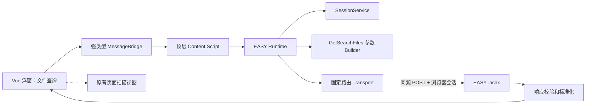

# PatMail Phase 2.1 架构

本阶段在已有 Manifest V3、Vue 3、TypeScript、Vite、Shadow DOM 浮窗、Popup 和 L2 页面扫描器上增加只读 EASY 文件查询。原浮窗拖拽、收缩、关闭、重新注入、页面扫描及复制 JSON 保持原路径；文件查询是同一浮窗中的独立视图。

## 职责和执行上下文

| 模块 | 职责 |
|---|---|
| `src/floating/FileSearchPanel.vue` | 登录状态、四项文本筛选、结果卡片、刷新与分页；只接收标准化结果。 |
| `src/shared/message.ts`、`src/api/message-guards.ts` | 固定消息类型和运行时负载校验；没有任意 URL/Call 请求消息。 |
| `src/content/index.ts` | 在当前顶层文档创建一个 `EasyRuntime`；为浮窗响应检查、查询和取消。 |
| `src/api/client.ts` | 会话门控、重复查询合并、旧查询中止与序号防竞态。 |
| `src/api/session.ts` | 调用 `GetUserModel`。`IsLogin=true` 且 `Status` 不为 false 视为已登录；该接口的 `Result=false` 不是登录失败。摘要只取已确认的 `UserModel.Name` / `user_name` / `user_id`。 |
| `src/api/file-search-params.ts` | 简化筛选到文档化表单参数的独立转换。 |
| `src/api/transport.ts` | 固定 EASY Origin、两条 Handler/Call、POST、编码、同源凭据、15 秒超时与取消。 |
| `src/api/response-guards.ts`、`file-search-normalizer.ts` | 公共状态和业务数据运行时校验；只向 UI 交付 `PatentFile[]`。 |
| `src/api/config.ts` | 当前环境的文件来源、案件类型 ID、`is_pat` 和列配置；不作为跨租户事实。 |

正式请求在 EASY 页面的 **Content Script 隔离环境**执行。浏览器自己的 `fetch` 以 `credentials: 'same-origin'` 自动附带当前站点会话；代码不读取、复制、打印或保存 Cookie。自动化 E2E 拦截固定 EASY Origin，用 HttpOnly Mock Cookie 证明这条路径且不接触真实服务器。2026-09-24 又在加载了 `dist` 的 Chromium 里，用原网站登录后的浏览器会话完成了同一条查询。Background Service Worker 仍只承担原有 PING，不代理业务请求，因此休眠不会丢失浏览器维护的会话。

文件查询不要求 `FileSearch.aspx` iframe 已打开，不读取 iframe 控件，不触发原网站查询按钮，也不修改网站表单。L2 DOM Scanner 仍只扫描顶层普通 document，供人工调试；API 查询不依赖扫描结果。后续如需动态租户列配置或业务 Schema，可在 `config.ts` 与 Builder 之间增加配置提供器，并保留现有运行时接口。

关闭浮窗会取消正在进行的会话检测和文件查询，卸载 UI；不清理网站状态或浏览器会话。重新打开会重新检查会话。查询结果只留在页面内存。`GetUserModel` 约 100 KB，含菜单和 `SessionId`；解析后立即丢弃原文，消息里只有 `SessionSummary`。无全量查询、无自动登录、无写接口、无文件下载、无后端。
