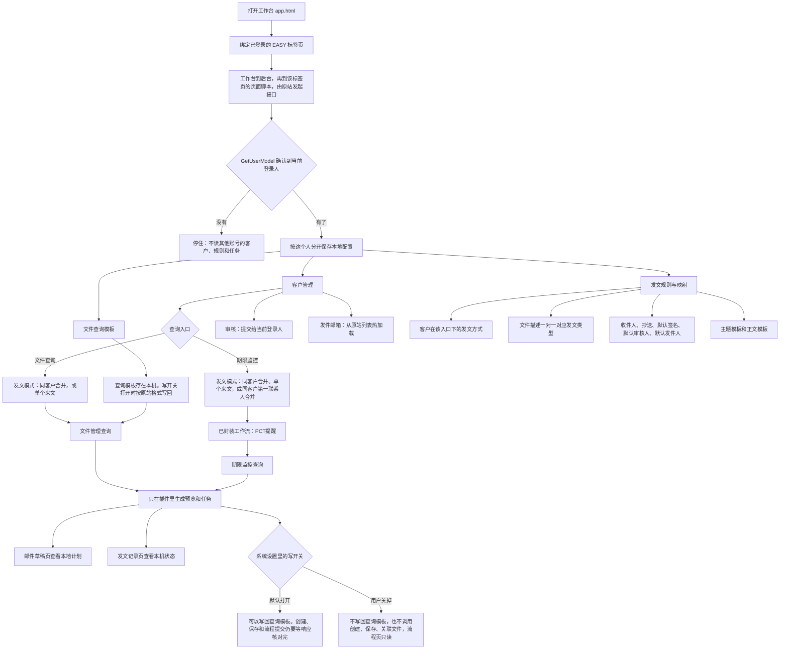
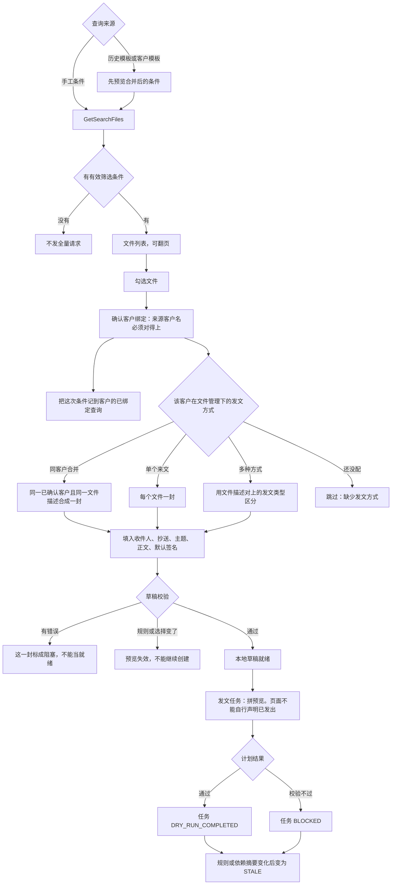
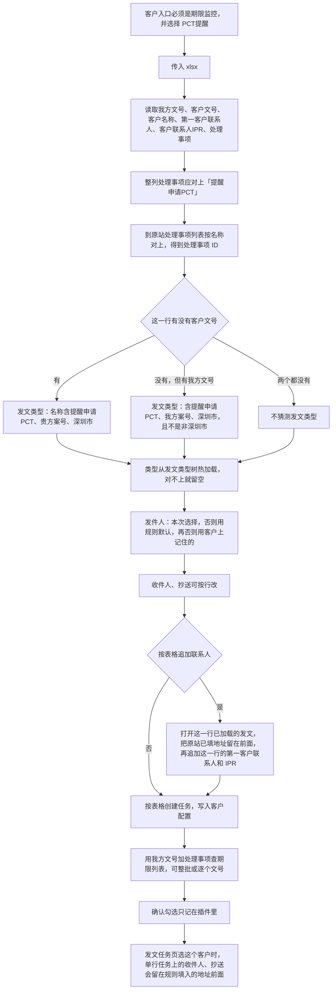
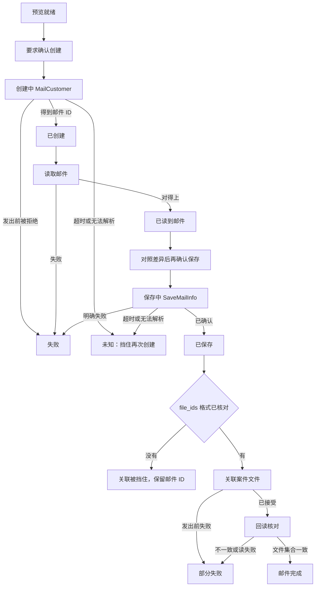
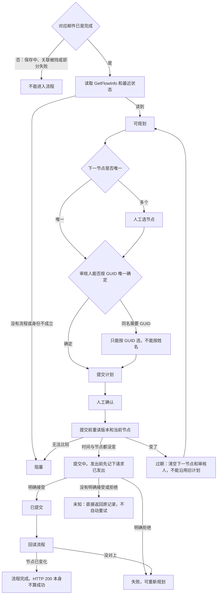

# 当前业务流图

现在能走完的是「连上 EASY、配好客户和规则、查出案件、在插件里拼出发文预览」。写开关在系统设置里，默认打开。关掉之后不会写回查询模板，也不会创建邮件、保存草稿或提交流程。打开之后也要等创建、保存和提交流程的响应核对完，才会真正发出。

## 总览

## 文件管理

查询之后按客户和文件描述分组，再套规则。缺客户、缺描述、缺发文方式，或同一描述对上多种发文类型，这一件就不进草稿。

## 期限监控与 PCT 提醒

期限监控目前只封装了 PCT 提醒。表格一行是一个发文任务，任务记在客户配置上，创建之后仍会用我方文号和处理事项再查一遍，但不会提交到 EASY。

发文任务页的 PCT 入口走同一条路：记下任务、转到期限监控，按我方文号再查一遍并确认勾选。客户已经绑了原网站编号时，记下任务前会读客户资料页的联系人，只在姓名对上唯一邮箱时补进行里；客户要求也在客户管理里按这个编号读取。创建邮件和流程提交仍停在响应核对之前，这一步不会发到 EASY。

## 邮件执行状态机

写开关默认打开。关掉之后这条不会发出。

## 流程提交状态机

邮件要先核验完成，才允许读流程。写开关默认打开；关掉之后不会提交。

